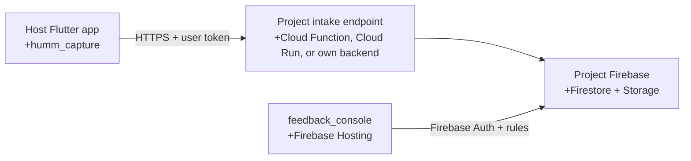

# Self-hosted Feedback Console

This guide installs the complete feedback workflow in one Firebase-backed
Flutter project. It is designed for any internal or customer-facing Flutter application.

## What is included

The `humm_capture` repository contains two deliverables:

| Deliverable | Responsibility | Runs in |
| --- | --- | --- |
| `humm_capture` | Capture the Flutter view, let a tester add markers and a message, then submit a portable report. | The host Flutter app. |
| `feedback_console` | Authenticate reviewers, display reports and screenshots, change status, show status history, and let administrators delete a report with its screenshot. | A separate Flutter Web deployment. |

The SDK is backend-neutral. The current `feedback_console` is intentionally
Firebase-backed: it reads its target project's Firestore and Storage through
Firebase Auth. A non-Firebase project can still use the SDK with its own HTTP
endpoint, but needs its own panel adapter or a server process that copies the
accepted reports into this Firebase contract.



## One-time Firebase setup

Complete these steps in the Firebase project owned by the host application.

1. Enable Firebase Authentication and create the reviewer accounts through the
   host application's usual sign-in method.
2. Create a Firebase **Web app**. Its configuration is required by the panel,
   not by the SDK.
3. Ensure Cloud Firestore and Cloud Storage are enabled.
4. Add a server-side intake endpoint (e.g. 2nd Gen Cloud Function or Cloud Run).
   - Ensure the endpoint has the Cloud Run Invoker (`roles/run.invoker`) permission
     granted to `allUsers` so that HTTPS requests can reach the function. Authentication
     is verified in code via the Firebase ID token in the `Authorization: Bearer <token>` header.
   - The endpoint authenticates the caller, validates the report payload, writes the screenshot
     to Storage using the Firebase Admin SDK, and creates the Firestore document.
5. Merge `feedback_console/firebase/firestore.rules` and
   `feedback_console/firebase/storage.rules` with the project's existing
   security rules. Do not overwrite unrelated application rules.
6. Give the service account running the intake endpoint permission to create
   objects in the project's Storage bucket (`roles/storage.objectCreator` minimum).

Storage Rules do not grant permissions to the Firebase Admin SDK. The service
account IAM permission in step 6 is therefore required even when the Storage
rules are correct.

## 1. Add the SDK to the Flutter app

Add the package to the application's `pubspec.yaml`:

```yaml
dependencies:
  humm_capture: ^1.0.0
```

Create one controller at a stable application scope. Wrap the app content with
`FeedbackCaptureBoundary` and send reports to the application's endpoint:

```dart
final feedbackController = FeedbackCaptureController();

FeedbackCaptureBoundary(
  controller: feedbackController,
  reporter: HttpFeedbackReporter(
    endpoint: Uri.parse('https://europe-west1-example.cloudfunctions.net/api/feedback'),
    headersProvider: () async => <String, String>{
      'authorization': 'Bearer ${await currentUserIdToken()}',
    },
  ),
  contextProvider: () => FeedbackContext(
    appVersion: currentAppVersion(),
    buildNumber: currentBuildNumber(),
    platform: FeedbackPlatform.android,
    screenName: currentRouteName(),
    locale: currentLocale(),
  ),
  child: const Application(),
)
```

`currentUserIdToken`, version values, platform and route name belong to the
host application. Do not place access tokens, server secrets or credentials in
`FeedbackContext.metadata`.

By default, a three-finger long press opens the feedback flow. For an explicit
QA-only action instead, set `trigger: FeedbackTrigger.none` and call:

```dart
await feedbackController.captureAppView();
```

The SDK reports completion asynchronously. The tester gets a progress notice
followed by success or failure; the composer does not wait on the network
request before it closes.

## 2. Implement the project intake endpoint

The endpoint is project-owned. It receives the JSON created by
`HttpFeedbackReporter` and must:

1. Verify the Firebase ID token, session token, or another project-owned
   authorization mechanism.
2. Reject invalid JSON, unknown fields where appropriate, and screenshots that
   exceed the project limit.
3. Decode `imageBase64` and store it under `feedback/<reportId>.png` using the
   Firebase Admin SDK.
4. Create `feedbackReports/<reportId>` with the report details and a
   `screenshotPath`.
5. Return a `2xx` response containing `feedbackId`, `reference`, or `id`.

The panel currently expects this minimum document shape:

```json
{
  "applicationId": "your_app.mobile",
  "applicationName": "Your Application",
  "message": "The button overlaps the price on a small screen.",
  "annotationCount": 1,
  "context": {
    "appVersion": "1.0.1",
    "platform": "android",
    "screenName": "checkout"
  },
  "screenshotPath": "feedback/<reportId>.png",
  "status": "new",
  "createdAt": "server timestamp",
  "updatedAt": "server timestamp"
}
```

`applicationId` and `applicationName` are server-side project values. They
identify the application in the panel; the SDK does not infer them.

The intake may enrich the context with the verified user ID, but must not
trust a client-supplied identity blindly. It should return `4xx` for an invalid
or unauthorized request and `5xx` only for temporary server failures.

## 3. Configure reviewer access

The console signs in through Firebase Auth and then reads a matching
`users/<uid>` document.

For the first administrator, create/update that existing user document from a
trusted server-side tool or Firebase Console:

```json
{
  "email": "reviewer@example.com",
  "displayName": "Reviewer Name",
  "feedbackRole": "admin"
}
```

The console also understands an existing application-level `role: "admin"`.
That keeps it compatible with applications that already use that field.

Roles:

| Role | Inbox | Change status | Manage Access |
| --- | --- | --- | --- |
| `reviewer` | Yes | Yes | No |
| `admin` | Yes | Yes | Yes |

An administrator can use the panel's **Access** view to set the narrower
`reviewer` role on existing user documents. Do not allow a client to create a
new document with an administrator role.

## 4. Run the panel locally

The panel lives in `feedback_console` and is not published to pub.dev. Copy
its example config first:

```bash
cd feedback_console
cp config/feedback_console.example.json config/feedback_console.json
```

Fill the values from **Firebase Console → Project settings → Your apps → Web
app**, then run:

```bash
fvm flutter pub get
fvm flutter run -d chrome --dart-define-from-file=config/feedback_console.json
```

The configuration identifies a Firebase project. It is public client
configuration, but it must still stay in a local file because every project
has different values. It does not grant access without Firebase Auth and the
deployed security rules.

## 5. Build and host the panel

Build the static Flutter Web output using the same configuration:

```bash
cd feedback_console
fvm flutter build web --release --dart-define-from-file=config/feedback_console.json
fvm dart run tool/prepare_hosting_build.dart
```

The target project's Firebase Hosting configuration must point at a directory
inside that project's repository. Copy the generated output there, then deploy
the target's Hosting site:

```bash
rsync -a --delete feedback_console/build/web/ ../your-project/feedback_console/build/web/
cd ../your-project
firebase deploy --only hosting:feedback
```

Do not commit `feedback_console/config/feedback_console.json`, generated
`build/` output, backend secrets, private keys, or service-account files.

## Validation checklist

Before using the setup with testers, verify all of the following:

- A signed-in mobile user can send one feedback report.
- The intake returns `201`/`2xx` without exposing technical credentials.
- One screenshot appears at the expected Storage path.
- The matching Firestore document has `status: "new"`.
- A reviewer can sign in to the panel, see the report and its image.
- A reviewer can move it to `in_review` and then `resolved`; both changes
  appear in status history.
- A non-reviewer cannot read reports or screenshots.
- An admin can grant and revoke reviewer access.

## Troubleshooting

| Symptom | Likely cause | What to check |
| --- | --- | --- |
| The SDK reports a timeout or `503`. | Intake endpoint failed. | Cloud Function/Cloud Run logs and request authentication. |
| The endpoint logs `storage.objects.create` denied. | Server service account lacks bucket IAM write access. | Grant that service account `roles/storage.objectCreator` on the exact bucket. |
| Panel shows Firestore `permission-denied`. | Missing `users/<uid>` role or rules not merged. | Auth user, role document, then deployed Firestore rules. |
| Screenshot placeholder appears. | Panel cannot read the stored path. | `screenshotPath`, Storage rules and image existence. |
| A reviewer sees an Access error. | Access view is limited to admins. | Ensure `feedbackRole: "admin"` or existing `role: "admin"`. |

## What is deliberately not automated

The package does not create Firebase projects, Firebase Web apps, roles,
service-account IAM bindings, or backend endpoints. Those operations are
security-sensitive and differ between organizations. The reusable parts are
the Flutter SDK, the console source, rules templates and this data contract.
